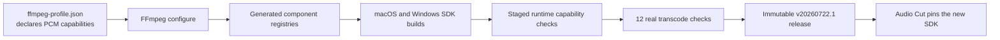

# Raw PCM Recording SDK Capability Design

## 1. Purpose

The desktop recorder stores captured audio as headerless little-endian PCM before FFmpeg writes the selected output container. The current SDK exposes PCM 16-bit and Float32 codecs but no raw PCM input demuxers, so FFmpeg rejects commands such as `-f s16le` before encoding begins. It also lacks the 24-bit and 32-bit integer codecs required by the recorder's supported sample formats.

This change makes raw PCM transcoding a tested capability of `ffmpeg-base`. It covers four PCM input formats and WAV, MP3, and M4A outputs on the existing desktop platform matrix, then publishes the result as immutable SDK version `20260722.1`.

## 2. Scope

The change includes:

- four raw PCM input demuxers: 16-bit integer, 24-bit integer, 32-bit integer, and 32-bit float;
- the missing 24-bit and 32-bit integer PCM decoders and encoders;
- configure-time registry validation;
- staged-SDK runtime capability validation;
- twelve end-to-end raw PCM transcode cases;
- the immutable `v20260722.1` desktop SDK release.

The change does not:

- add client-side format fallback or temporary container conversion;
- change FFmpeg 8.1.2, the vcpkg baseline, external dependencies, or LGPL license mode;
- change the four-platform build matrix;
- change the GitHub Release asset schema;
- modify the Audio Cut client before the cloud SDK build has completed successfully.

## 3. Architecture and Ownership

`ffmpeg-base` remains the single owner of FFmpeg feature selection and SDK production. The client consumes an immutable SDK and does not compensate for missing FFmpeg components.



Component responsibilities:

| Component | Responsibility |
|---|---|
| `config/ffmpeg-profile.json` | Declares the shared raw PCM demuxers and PCM codecs. |
| `scripts/validate-ffmpeg-components.cmake` | Verifies generated FFmpeg registries without executing target binaries. |
| `scripts/validate-sdk-layout.cmake` | Verifies staged SDK layout, runtime tools, and exposed FFmpeg capabilities. |
| Raw PCM transcode validator | Generates short PCM samples, runs the staged FFmpeg and FFprobe, and validates outputs. |
| `tests/cmake/test_release_workflow.cmake` | Protects the profile, validation wiring, SDK version, and release contract. |
| `.github/workflows/build-desktop.yml` | Runs the existing platform matrix and publishes the immutable release. |

The workflow YAML should not duplicate capability logic. Existing build scripts continue to call the component and staged-SDK validators.

## 4. FFmpeg Capability Profile

### 4.1 Raw PCM demuxers

The common feature list adds:

```text
demuxer-pcm_s16le
demuxer-pcm_s24le
demuxer-pcm_s32le
demuxer-pcm_f32le
```

The common configure list adds:

```text
--enable-demuxer=pcm_s16le
--enable-demuxer=pcm_s24le
--enable-demuxer=pcm_s32le
--enable-demuxer=pcm_f32le
```

FFmpeg configure component names include the `pcm_` prefix. Runtime input names remain `s16le`, `s24le`, `s32le`, and `f32le`.

### 4.2 PCM decoders and encoders

The common feature list adds:

```text
decoder-pcm_s24le
decoder-pcm_s32le
encoder-pcm_s24le
encoder-pcm_s32le
```

The common configure list adds:

```text
--enable-decoder=pcm_s24le
--enable-decoder=pcm_s32le
--enable-encoder=pcm_s24le
--enable-encoder=pcm_s32le
```

The profile already contains the 16-bit and Float32 PCM decoders and encoders. Validation covers all four formats so later profile trimming cannot remove an existing format unnoticed.

### 4.3 Existing output capabilities

No additional output muxer or compressed codec is required:

| Output | Existing capability |
|---|---|
| WAV | `muxer-wav` and the selected PCM encoder |
| MP3 | `muxer-mp3` and `encoder-libmp3lame` |
| M4A | `muxer-ipod`/`muxer-mov` and `encoder-aac` |

Raw PCM output muxers for s16le, s24le, and s32le are outside this scope because the client exports WAV, MP3, or M4A rather than headerless PCM.

## 5. Validation Design

Validation uses three layers. Any failure blocks the platform artifact and therefore blocks release publication.

### 5.1 Release declaration tests

`tests/cmake/test_release_workflow.cmake` verifies:

- SDK version `20260722.1`;
- all eight new profile features;
- all eight matching configure flags;
- configure demuxer names use `pcm_s16le` and the equivalent formal component names;
- invalid forms such as `--enable-demuxer=s16le` are absent;
- component validation and staged runtime validation remain wired into both platform builds;
- the public release still contains exactly four SDK ZIP files and `artifact-index.json`.

### 5.2 Configure registry validation

`scripts/validate-ffmpeg-components.cmake` checks `libavformat/demuxer_list.c` for:

```text
ff_pcm_s16le_demuxer
ff_pcm_s24le_demuxer
ff_pcm_s32le_demuxer
ff_pcm_f32le_demuxer
```

It checks `libavcodec/codec_list.c` for the decoder and encoder symbols of all four formats:

```text
ff_pcm_s16le_decoder / ff_pcm_s16le_encoder
ff_pcm_s24le_decoder / ff_pcm_s24le_encoder
ff_pcm_s32le_decoder / ff_pcm_s32le_encoder
ff_pcm_f32le_decoder / ff_pcm_f32le_encoder
```

This layer does not execute a target binary and therefore protects Windows ARM64 cross-builds as well as native builds.

### 5.3 Staged SDK validation

`scripts/validate-sdk-layout.cmake` checks runtime lists on executable platforms:

| Command | Required names |
|---|---|
| `ffmpeg -demuxers` | `s16le`, `s24le`, `s32le`, `f32le` |
| `ffmpeg -decoders` | `pcm_s16le`, `pcm_s24le`, `pcm_s32le`, `pcm_f32le` |
| `ffmpeg -encoders` | `pcm_s16le`, `pcm_s24le`, `pcm_s32le`, `pcm_f32le` |

The existing SDK path, manifest, license, dynamic-library, runtime-path, and macOS signature checks remain unchanged.

## 6. End-to-End Transcode Matrix

An independent validator generates short, deterministic stereo PCM inputs with Python's standard library. It does not depend on Audio Cut code and does not commit binary fixtures.

Each input uses 48,000 Hz, two channels, and enough non-zero samples for FFprobe to observe a positive duration. The validator runs the same raw-input options used by the client:

```text
-f <runtime-pcm-format>
-ar 48000
-ac 2
-channel_layout stereo
-i <input.pcm>
```

The test matrix contains twelve cases:

| Input | WAV | MP3 | M4A |
|---|---:|---:|---:|
| `s16le` | pass | pass | pass |
| `s24le` | pass | pass | pass |
| `s32le` | pass | pass | pass |
| `f32le` | pass | pass | pass |

Every case verifies:

- FFmpeg exits with status zero;
- the output exists and is non-empty;
- FFprobe parses the output;
- sample rate is 48,000 Hz;
- channel count is two;
- duration is positive;
- WAV uses the matching PCM codec;
- MP3 uses the MP3 codec;
- M4A uses AAC.

Failure output includes platform, input format, target container, process exit code, FFmpeg stderr, and FFprobe stderr. Temporary inputs and outputs are removed after validation.

Platform execution rules:

- macOS arm64, macOS x86_64, and Windows x86_64 run static, runtime-list, and twelve-case transcode validation;
- Windows ARM64 runs declaration and generated-registry validation because its executable is cross-built on an x86_64 runner;
- any failed build matrix job prevents `publish-release` from running.

## 7. Versioning and Cloud Build

The immutable release identity is:

```text
FFmpeg version: 8.1.2
SDK version: 20260722.1
Release tag: v20260722.1
Feature profile: lgpl-desktop-app-v1
License mode: LGPL
```

The implementation flow is:

1. Make focused profile, validation, test, documentation, and SDK version changes.
2. Run local declaration tests and all locally executable validation.
3. Commit only the intended `ffmpeg-base` files to `main` and push `origin/main`.
4. Cancel the redundant push-triggered build if it is still queued or running.
5. Trigger `Build Desktop FFmpeg SDK` using `workflow_dispatch` on the updated `main`.
6. Confirm that the release build has a run ID and is queued or in progress.
7. Stop without waiting for cloud compilation and without modifying Audio Cut.

The existing workflow publishes these assets after all matrix jobs succeed:

```text
ffmpeg-sdk-8.1.2-v20260722.1-macos-arm64.zip
ffmpeg-sdk-8.1.2-v20260722.1-macos-x86_64.zip
ffmpeg-sdk-8.1.2-v20260722.1-windows-x86_64.zip
ffmpeg-sdk-8.1.2-v20260722.1-windows-arm64.zip
artifact-index.json
```

## 8. Follow-up Client Integration

Client integration begins only after the workflow and immutable GitHub Release have succeeded.

1. Confirm all four platform jobs and `publish-release` succeeded.
2. Download the published `artifact-index.json`.
3. Verify SDK version, release tag, four platform entries, URLs, sizes, and archive SHA256 values.
4. Calculate the published `artifact-index.json` SHA256.
5. Update `videobee-desktop/cmake/ffmpeg/FFmpegSdkArtifacts.cmake` with version `20260722.1`, the published index URL, and the actual index SHA256.
6. Configure a clean client build directory so the old SDK cache cannot be reused.
7. Build the client and run recording encoding integration tests using explicit SDK FFmpeg and FFprobe paths. A missing runtime must fail rather than silently skip.
8. Verify all four sample formats with WAV, MP3, and M4A, including stop-recording output creation, Take creation, and FFprobe readability.

If the cloud build fails, the client remains pinned to the previous SDK. The failed release version is not overwritten or reused; the fix uses a new immutable version such as `20260722.2`.

## 9. Acceptance Criteria

- The feature profile explicitly declares all required raw PCM input and PCM codec components.
- Static registry checks pass for all four platform builds.
- Runtime component checks pass on executable build platforms.
- All twelve raw PCM transcode cases pass on macOS arm64, macOS x86_64, and Windows x86_64.
- Windows ARM64 completes static component validation.
- Local declaration tests pass before submission.
- A focused commit is pushed to `origin/main`.
- A `workflow_dispatch` release build for `20260722.1` is queued or in progress before this task stops.
- No Audio Cut client source is modified in this task.
